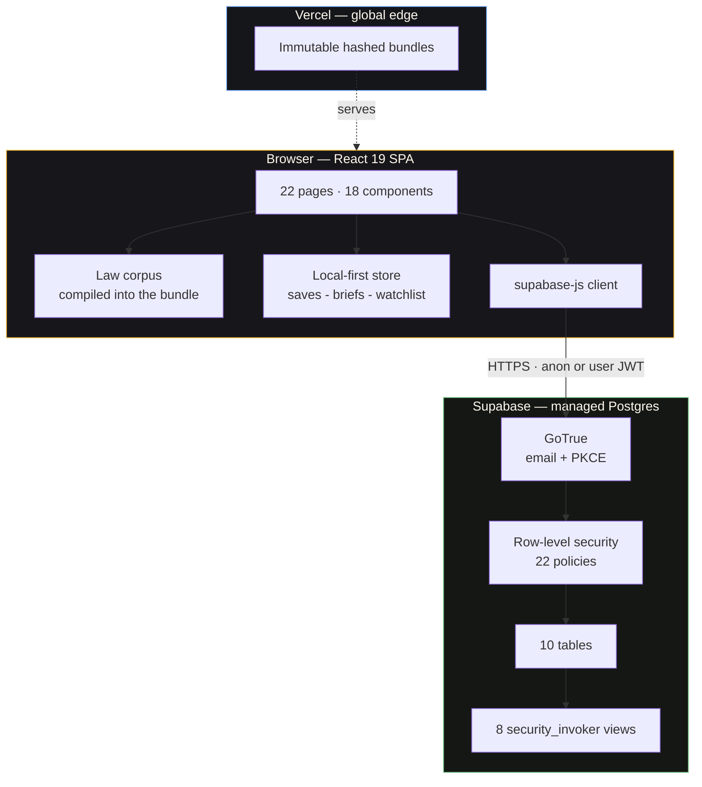
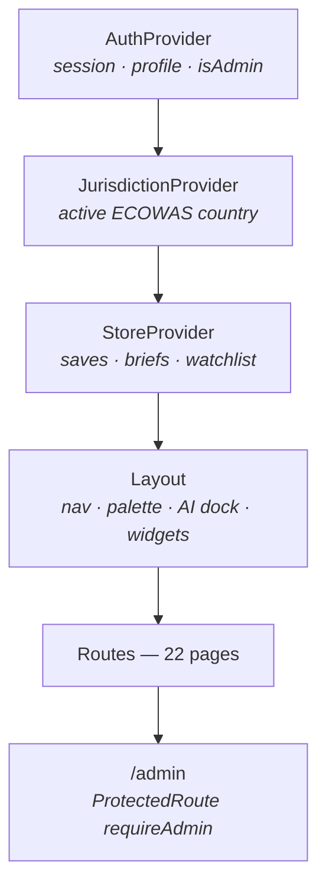
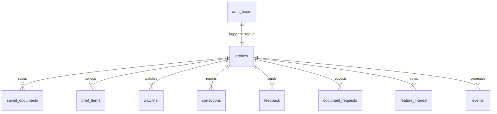
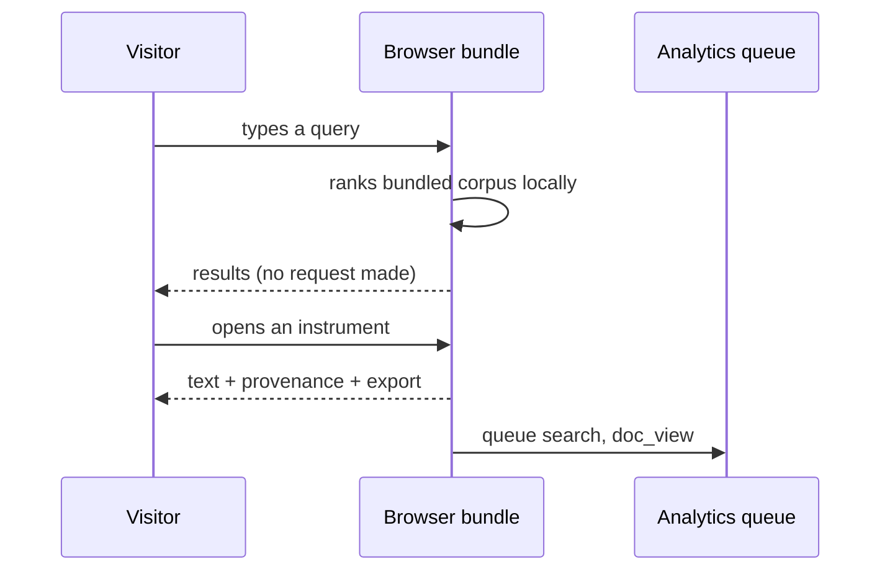
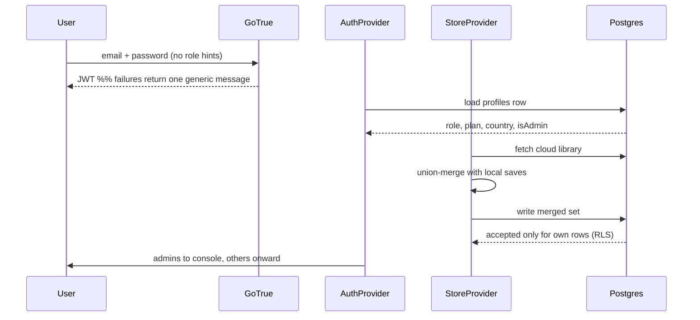
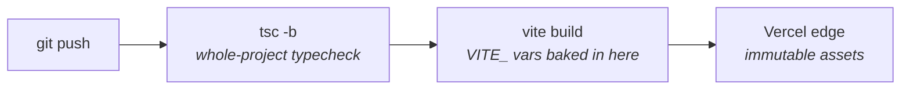

# LegalCore West Africa — System Blueprint

Architecture reference for the LegalCore platform: a legal research system covering the
12 ECOWAS member states, with the Liberian library live and the ECOWAS community corpus
available regionally.

> **Interactive version:** open [`index.html`](./index.html) in a browser. Same content,
> navigable, no build step or dependencies required.

---

## Contents

| Section | Covers |
|---|---|
| [1. The shape of the system](#1-the-shape-of-the-system) | What runs where, and the one idea behind it |
| [2. Frontend](#2-frontend) | Provider tree, module boundaries, routes |
| [3. Data model](#3-data-model) | Tables, views, what each answers |
| [4. Security model](#4-security-model) | RLS, keys, authentication, privacy |
| [5. Runtime flows](#5-runtime-flows) | Reading, signing in, analytics, admin |
| [6. Product architecture](#6-product-architecture) | Free vs paid, and how revenue switches on |
| [7. Design decisions](#7-design-decisions) | Trade-offs, recorded ADR-style |
| [8. Build, deploy, limits](#8-build-deploy-limits) | Pipeline, environment, known ceilings |

**At a glance:** ~14,000 lines of TypeScript/CSS · 22 pages · 18 components ·
10 tables · 8 views · 22 RLS policies · 3 migrations

---

## 1. The shape of the system

A single-page React application talking directly to Postgres. **There is no API server of
our own.** Authorisation lives in the database as row-level security policies rather than in
middleware.

### The one architectural idea

Most products place an API server between client and database so the server can decide who may
do what. This system removes that layer and pushes the same decision into Postgres, as policies
attached to each table.

That is why the browser can safely hold a publishable API key: **the key identifies the project,
it does not grant permission.** Every query still runs as the signed-in user — or as an anonymous
visitor — and the database rejects anything the policies disallow.

One less service to operate, and one less place for an authorisation bug to hide.

---

## 2. Frontend

### Provider tree

State has exactly one owner. Four providers wrap the router; components below read from hooks
rather than receiving props through intermediate layers.

### Module boundaries

| Directory | Holds | Rule |
|---|---|---|
| `pages/` | 22 route components, plus `pages/admin/` tabs | Fetch their own data; no shared global store |
| `components/` | 18 reusable pieces of UI | Presentational; side effects go through hooks |
| `hooks/` | auth, jurisdiction, store, theme, app config | One concern each |
| `lib/` | supabase client, analytics, nudge, feedback bus, auth redirect | Framework-free — no React imports |
| `data/` | law corpus, jurisdictions, plans, provenance | Typed constants, never mutated at runtime |
| `utils/` | smart search, citator, PDF export | Pure functions, testable in isolation |

### Routes

| Path | Page | Access |
|---|---|---|
| `/`, `/west-africa` | ECOWAS overview | Public |
| `/search` | Typo-tolerant search | Public |
| `/browse` | Browse by category | Public |
| `/document/:id` | Instrument, provenance, export | Public |
| `/compare` | Cross-state provision comparison | Public |
| `/ai` | Country-trained assistant | Public |
| `/map` | Courts and institutions | Public |
| `/saved` | Personal library and brief builder | Public, syncs when signed in |
| `/plans` | Roadmap with "I'd pay for this" votes | Public |
| `/methodology`, `/about` | Sourcing and provenance | Public |
| `/login`, `/auth/callback`, `/auth/reset` | Authentication | Public |
| `/admin` | Admin console — 7 tabs | **Admin only, enforced in Postgres** |

---

## 3. Data model

Ten tables in three groups: who the user is, what they produced, and what the product learned.

### Identity

| Table | Purpose |
|---|---|
| `profiles` | Public user record keyed to `auth.users`. Holds **role**, **plan**, country, profession, organisation, onboarding state, last seen. |

Created automatically by the `handle_new_user` trigger the moment an account appears, so there
is never a signed-in user without a profile.

### User-generated content

| Table | Purpose |
|---|---|
| `saved_documents` | A user's personal library |
| `brief_items` | Documents gathered into a working brief |
| `watchlist` | Instruments to be alerted about when amended |
| `corrections` | Reader-reported errors in the law text |
| `feedback` | Bugs, ideas, praise, content notes, with a rating |
| `document_requests` | "This law is missing" — a content backlog sourced from demand |

### Product intelligence

| Table | Purpose |
|---|---|
| `events` | First-party analytics: page views, searches, reads, AI questions, exports |
| `feature_interest` | "I'd pay for this" votes against roadmap features |
| `app_config` | Key/value feature flags read by the live app |

### Views behind the admin console

`insights_daily` · `insights_top_searches` · `insights_zero_result_searches` ·
`insights_top_documents` · `insights_country_activity` · `insights_feature_interest` ·
`insights_activity_heatmap` · `insights_inbox_daily`

Every view is declared `security_invoker = true`, so **row-level security still applies when it
is queried.** An aggregate is therefore admin-only by the same rules as the underlying table,
and the client never receives the raw rows it would need to compute these itself.

Two views pay for themselves:

- **`insights_zero_result_searches`** — every search that returned nothing, by frequency and
  country. A content roadmap written by users, in demand order.
- **`insights_country_activity`** — sessions, searches, reads and AI questions per country.
  Decides which national library opens next on evidence rather than instinct.

---

## 4. Security model

There is no server to trust, so nothing is enforced in the UI. Access rules live in the database
and apply identically to the app, a stray `curl`, or anyone poking at the API from a console.

### Three rules

1. **Deny by default.** RLS is enabled on every table. With no matching policy, a row is
   invisible. Access is granted explicitly, never assumed.
2. **Own your rows.** A user reads and writes only rows where `user_id = auth.uid()`. Admins get
   separate read policies via a security-definer `is_admin()` helper.
3. **Privilege is not self-service.** A trigger on `profiles` rejects any change to **role** or
   **plan** that did not come from an admin — a user cannot promote themselves or grant
   themselves a paid plan by editing their own row.

### Keys

| Key | Where it lives | Why that is safe |
|---|---|---|
| **Publishable** | Browser bundle, via `VITE_` env var | Identifies the project; grants nothing. Requests are still evaluated against RLS as the anonymous or signed-in user. |
| **Secret / service role** | **Nowhere in this project** | It bypasses RLS entirely. Never in a `VITE_` variable, a credentials file, or any committed file. |

> **Hard rule.** Any variable prefixed `VITE_` is compiled into JavaScript that every visitor
> downloads. Only the publishable key may ever go there. Credentials live in git-ignored files
> and are never committed.

### Authentication

| Path | Status | Detail |
|---|---|---|
| Email + password | **Live** | Sign up, sign in, reset. One door for everyone. |
| Magic link | Wired | Passwordless email sign-in. |
| Google OAuth | Built, disabled | PKCE flow ready; hidden until `google_login_enabled` is flipped in the admin console. |

**The sign-in page reveals nothing about roles.** There is no "admin login" and no hint that
privileged accounts exist. Administrators use the same form as everyone else and are routed by
the `role` the database reports after authentication. Failed sign-ins return one generic
message, so the form cannot be used to discover which email addresses are registered.

### Privacy posture

No third-party trackers, no advertising pixels, no measurement cookies. Events go to our own
Postgres table and nowhere else. No IP addresses or fingerprints are stored — events carry a
random session id, a country, and what happened. Enough to improve the product, not enough to
follow a person. For a platform where the query *is* the sensitive data, that matters.

---

## 5. Runtime flows

### Reading the law — no account, no network

### Signing in and merging a library

### Analytics — batched, cheap, interruption-proof

Events are queued in memory and flushed on a timer or once the batch fills, so a browsing session
costs one insert rather than dozens of requests. The queue also flushes on `visibilitychange` and
`pagehide`, so closing the tab does not lose the session. Clients may **insert only** — nobody can
read the events table back except an admin.

### Admin console

`ProtectedRoute requireAdmin` hides the page, but that is convenience, not security. The console
queries the eight insight views in parallel; because they are `security_invoker`, a non-admin
receives nothing regardless of how they reach the route. **The guard is in the database.**

A flag change in `app_config` reaches every live visitor on their next config read — no deploy.

---

## 6. Product architecture

Reading primary law is free and stays free. That is the mission, and it is also the moat.
Revenue comes from professional workflow built on top.

| Free, permanently | Paid later — professional workflow |
|---|---|
| Full-text search across every instrument | Citation and amendment alerts |
| Read, copy, print, export any law | Firm workspace: shared briefs, roles |
| AI assistant, per country | AI memo drafting with pinned citations |
| Compare provisions across ECOWAS states | Offline country packs |
| Saved library and brief builder | Branded exports with table of authorities |
| Report a correction · courts map | Compliance checklists · developer API |

Nothing on the right restricts access to the law. It sells time saved to people whose time is
billable.

### Demand before build

Every roadmap feature ships to the public plans page with an "I'd pay for this" button. Votes land
in `feature_interest` and surface in the admin console ranked by demand. Features get built in the
order users are willing to pay for them, not the order they were imagined.

### Switching revenue on

The groundwork is already in the schema: `profiles.plan` exists and is trigger-protected against
self-service upgrades, and `app_config.paywall_enabled` is the single switch that turns gating on.
Adding billing later is a payment webhook writing to `plan` plus flipping one flag — not a
re-architecture.

**Everything is free today.** The flag ships off deliberately; the machinery exists so that
charging becomes a business decision available on any given Tuesday rather than an engineering
project.

---

## 7. Design decisions

Recorded so a future maintainer can tell a deliberate trade-off from an accident.

### ADR-01 — No API server; RLS is the authorisation layer
- **Context.** A small team needs authorisation it cannot get wrong.
- **Decision.** The browser queries Postgres directly. RLS policies are the only access control.
- **Gains.** No server to run, patch or pay for. One place to audit. Rules apply to every client
  equally, including ones we did not write.
- **Costs.** Authorisation is expressed in SQL, less familiar than middleware. Policy mistakes are
  severe, so migrations need careful review.

### ADR-02 — The law corpus is a build artefact, not database rows
- **Context.** Connectivity across West Africa is uneven and often metered.
- **Decision.** Primary law is compiled into the bundle as typed modules, served from the CDN.
- **Gains.** Instant, offline-capable search. Zero database cost for the most common action.
  Read-only data cannot be corrupted at runtime.
- **Costs.** Publishing a law requires a deploy, and the bundle grows with the corpus.
- **Revisit when.** Editors need to publish without engineers, or the bundle outgrows a cheap
  download. Then: corpus in Postgres with full-text indexes, plus a cached offline pack.

### ADR-03 — Local-first storage, merged on sign-in
- **Context.** Forcing an account before a first-time visitor can save anything loses the visitor.
- **Decision.** Saving works signed out and persists locally; signing in union-merges local and
  cloud state.
- **Gains.** No feature gated behind registration. Nothing lost by signing in late. Sign-up is
  encouraged by value, not by a wall.
- **Costs.** Two sources of truth to reconcile. Merge is additive, so a deletion made while signed
  out does not propagate.

### ADR-04 — One sign-in door, no role hints
- **Context.** A visible "admin login" advertises where the valuable accounts are.
- **Decision.** Everyone uses one form. Role is read from the database after authentication and
  only affects routing.
- **Gains.** No reconnaissance surface. Generic failure messages prevent email enumeration.
- **Costs.** Administrators get no dedicated entry point.

### ADR-05 — Feature flags in the database, not the bundle
- **Context.** Announcements, sign-in providers and the paywall must change faster than a deploy.
- **Decision.** Behaviour reads from `app_config`, editable in the admin console.
- **Gains.** Operational changes take seconds. A broken provider can be switched off without a
  rebuild.
- **Costs.** A config read on load, and the need for sane defaults if the fetch fails.

### ADR-06 — First-party analytics, deliberately incomplete
- **Context.** A legal platform must not leak what a person is researching.
- **Decision.** Batched inserts into our own table. No third parties, IPs, fingerprints or
  measurement cookies.
- **Gains.** Credible privacy for a sensitive use case. Data stays in the same database as the
  rest of the product.
- **Costs.** No funnel tooling out of the box; coarser attribution than a commercial product.

### ADR-07 — Insights as security-invoker views
- **Context.** Aggregates would otherwise require shipping raw rows to the client.
- **Decision.** Aggregate in Postgres through views declared `security_invoker = true`.
- **Gains.** RLS applies to the aggregate, so a non-admin gets nothing. Clients download
  summaries, not the event log.
- **Costs.** Aggregation happens per request; heavy views will eventually need materialising.

---

## 8. Build, deploy, limits

### Pipeline

> **Consequence worth remembering.** Because environment variables are compiled in at build time,
> changing one in the hosting dashboard does nothing until the next deploy. New env var, new build
> — always.

### Environment

| Variable | Purpose |
|---|---|
| `VITE_SUPABASE_URL` | Project endpoint |
| `VITE_SUPABASE_PUBLISHABLE_KEY` | Browser-safe project key |

Absent either one, the Supabase client is `null` and the app runs fully local: the law is still
searchable and readable, accounts and sync are simply unavailable. **Degradation is a designed
state, not a crash.**

### Migrations

Applied in order. Numbered, forward-only.

| File | Establishes |
|---|---|
| `0001_auth_and_library.sql` | Roles, profiles, personal library, corrections, RLS, privilege-escalation trigger |
| `0002_product_platform.sql` | Profile preferences, feedback, document requests, events, feature interest, config, six insight views |
| `0003_admin_insights.sql` | Activity heatmap and inbox calendar views |

### Quality gates

TypeScript strict mode — the build fails on any type error. ESLint with React Hooks rules,
including purity and effect discipline. Every change verified against a real `vite build`, not
just the dev server.

### Known limits

Stated plainly, because a blueprint that only lists strengths is marketing.

| Limit | Bites when | Answer |
|---|---|---|
| Corpus ships in the bundle | Coverage passes a few countries | Postgres full-text search; keep a cached offline pack |
| Single JS chunk over 500 kB | First load on a slow connection | Route-level code splitting (maps and PDF already lazy) |
| Views aggregate per request | Event volume grows | Materialised views on a refresh schedule |
| Publishing needs a deploy | Non-engineers become editors | Corpus in the database with an editor role and review workflow |
